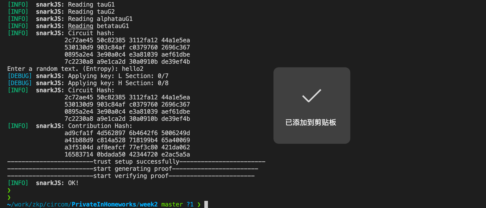

## Week2 Assignments: Classical Protocol Engineering Practice


当前目录使用了[circom](https://docs.circom.io/)来将下方的函数`f(x, y, z)`转换为零知识证明zk-SNARKs的circuit，并完成可验证计算。
```javascript
def f(x, y, z):
  if x == 1:
    return y*z
  return 2y - z
}
```

### Circom介绍
Circom是一个底层用rust实现的编译器，它可以编译用circom语言实现的circuit。它将circuit编译的结果以contraints的形式输出，这些constraints能被用于计算相应生成逻辑的proof。


### circuit实现
基本思路: 
1. 将 `x == 1` 转换为bool值`w`；
2. 通过 `w * branch1 + (1-w) * branch2`将函数转换为circuit.

#### 1. 将 `x == 1` 转换为bool值`w`
判断两个输入是否相等, 引用了circom提供的模版库[circomlib](https://github.com/iden3/circomlib/blob/master/circuits/comparators.circom)中的模版
- IsZero 和 IsEqual 
```
template IsZero() {
    signal input in;
    signal output out;

    signal inv;

    inv <-- in!=0 ? 1/in : 0;

    out <== -in*inv +1;
    in*out === 0;
}

template IsEqual() {
    signal input in[2];
    signal output out;

    component isz = IsZero();

    in[1] - in[0] ==> isz.in;

    isz.out ==> out;
}
```

### 2. 将`f(x, y, z)`的实现通过一个多项式来表示
```
w * y * z + (1 - w) * (2y - 1)
```
然后在将上述多项式拆分成3个乘法门

- Multiplier2 基本乘法门
```
template Multiplier2(){
   //Declaration of signals.
   signal input in1;
   signal input in2;
   signal output out;

   //Statements.
   out <== in1 * in2;
}
```

- 最终circuit实现
```
   // x*y
   component mul1 = Multiplier2();
   y ==> mul1.in1;
   z ==> mul1.in2;
   
   // (1 - w) * (2y - z)
   component mul2 = Multiplier2();
   1 - ise.out ==> mul2.in1;
   2 * y - z  ==> mul2.in2;

   // w * (x * y) + (1 - w) * (2y - z)
   out <== ise.out * mul1.out + mul2.out;
```

### 运行

实现完circuit后，接下来我们将根据circuit和用户输入input.json来进行可验证计算

#### 1. 安装相关依赖包
- 安装 rust 
```
curl --proto '=https' --tlsv1.2 https://sh.rustup.rs -sSf | sh
```
- 安装 circom 
```
git clone https://github.com/iden3/circom.git
cargo build --release
cargo install --path circom
```
- 安装 nodejs 
```
curl -L https://bit.ly/n-install | bash
```
- 安装 snarkjs
```
npm install -g snarkjs
```

#### 2. 执行可验证计算
```
sh build.sh
```
代码的运行具体分为以下5个步骤
- 编译 ciruit, 生成 r1cs;
- 基于 input 生成 witness;
- Trust setup;
- Generate proof: 由prover根据witness和prove key生成proof;
- Verify proof: 由verifier根据public input和verification key对proof进行验证.

代码运行截图:



