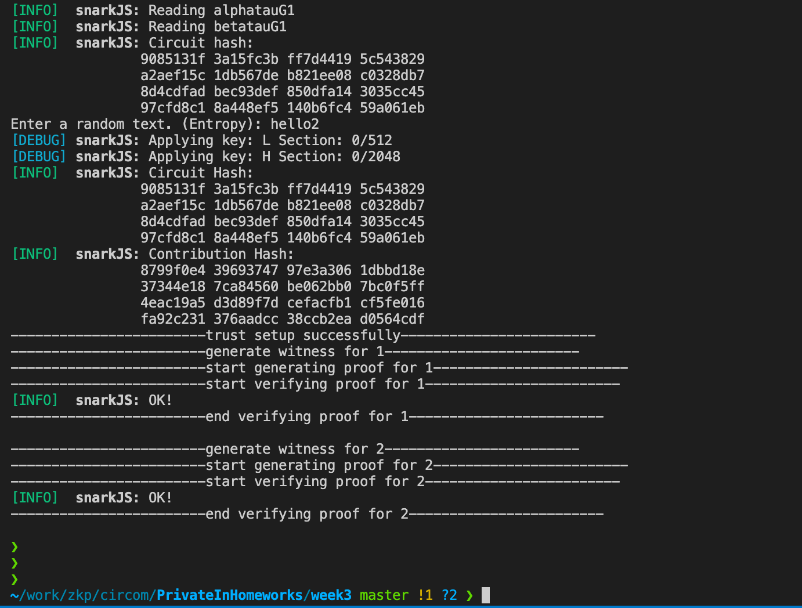

## Week3 Assignments: 256-bit length addition circuit design

### 设计思路
1. 将256位的字符加法拆分成256个`2进制位的加法门`;

2. 加法门为三个输入 `A[i]`, `B[i]`, `Carray[i+1]` 两个输出 `C[i]`和`Carray[i]`。编码方式为高位在前，低位在后;
$$
{C}_{i}+{Carray}_{i}={A}_{i}+{B}_{i}+{Carry}_{i+1}
$$
- 末位进位carray初始为0
$$
{Carry}_{255} = 0
$$

3. 将256个单字符的加法门连接起来.

边界情况：

> 为了处理两个数相加之后越界的情况，我们将输出out定义为257位，比输入in的位数多了1位

### 仓库代码与commit hash
- 代码库：https://github.com/johnz1019/PrivacyIN-Phase1-Assignments/tree/master/week3
- commit hash: 


### 运行方式:
#### 1. 安装相关依赖包
- 安装 rust 
```
curl --proto '=https' --tlsv1.2 https://sh.rustup.rs -sSf | sh
```
- 安装 circom 
```
git clone https://github.com/iden3/circom.git
cargo build --release
cargo install --path circom
```
- 安装 nodejs 
```
curl -L https://bit.ly/n-install | bash
```
- 安装 snarkjs
```
npm install -g snarkjs
```

#### 2. 执行可验证计算

```
git clone https://github.com/johnz1019/PrivacyIN-Phase1-Assignments.git
cd PrivacyIN-Phase1-Assignments/week3/
sh build.sh
```

代码的运行具体分为以下5个步骤
- 编译 ciruit, 生成 r1cs;
- 基于 input 生成 witness;
- Trust setup;
- Generate proof: 由prover根据witness和prove key生成proof;
- Verify proof: 由verifier根据public input和verification key对proof进行验证。

### 运行截图


